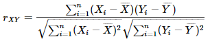
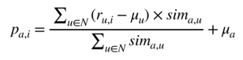
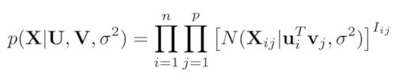
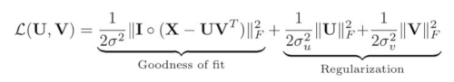

# Project 5 - Batch 2- Social Recommendation Systems (CiaoDVD Dataset)
The aim of this project is to build a tool that implements and compares different types of recommendation algorithms on a real-world dataset. The technical aspects are described below.

## Index
* [Dataset Description](#dataset)
* [Libraries and Modules](#libs)
* [Files Organization](#organization)
* [Memory Based Implementation](#meb)
* [Model Based Implementation](#mob)
* [Code Testing](#testing)

# <a name="dataset"></a> Dataset Description
The data source used for this implementation can be found in https://www.librec.net/datasets.html **CiaoDVD**, which consists of 3 diferent *.txt files with the information about some DVDs in 2013.

The particular file utilized in this project is [movie-ratings](Ciao-DVD-Datasets/movie-ratings.txt), which contains the following information:
1. File: movie-ratings.txt (size: 72,665 --> 72.7K)
2. Columns: userID, movieID, genreID, reviewID, movieRating, date

# <a name="libs"></a> Libraries and Modules
This implementation requires the instalation of the following tools:
* python version 3.xx
* pandas
* numpy
* matplotlib

The following tools are required only if __*.ipynb__ files are executed. Installing them is not mandatorily required.
* jupyterlab
* ipython

# <a name="organization"></a> Files Organization
```
📁 Ciao-DVD-Datasets
 └── movie-ratings.txt
📁 Images
📁 results
📁 support
 └── data_loading_analysis.py
 └── evaluation_metrics.py
 └── plots_custom.py
📄 main_pc.py
📄 main_pmf.py
📄 memory_based_cf.py
📄 model_based_cf.py
📓 Main_MeB.ipynb
📓 Main_MoB.ipynb
```
[main_pc.py](main_pc.py): Contains the main implementation for User-based Colaborative Filtering Recommender System using Pearson Correlation in pure python.

[main_pmf.py](main_pmf.py): Contains the main implementation for Recommender System using Probabilistic Matrix Factorization in pure python.

[memory_based_cf.py](memory_based_cf.py): Contains all functions for User-based Colaborative Filtering using Pearson Correlation.

* pearson_correlation
* neighborhood
* get_user_avgs
* predict

[model_based_cf.py](model_based_cf.py): Contains all functions for the model of Probabilistic Matrix Factorization.

* train
* loss
* prediction

[support/data_loading_analysis.py](support/data_loading_analysis.py): Contains functions for dataset processing (loading, spliting, analysis data).

[support/evaluation_metrics.py](support/evaluation_metrics.py): Contains functions for RMSE and MAE functions.

[support/plots_custom.py](support/plots_custom.py): Contains customized functions for plotting the data.

The following two are the Main files for running the application with JupyterLab. The are not necessary when running the code direclty in Python.
[Main_MeB.ipynb](Main_MeB.ipynb): The same code that main_pc.py  for jupyter notebook.

[Main_MoB.ipynb](Main_MoB.ipynb): The same code that main_pmf.py for jupyter notebook.

# <a name="meb"></a>Memory Based Implementation
### Details
- Before running the core of the algorithm there is an optional section which is used to prune the dataset to reduce the size of the original dataset. The prune dataset method accepts parameters for prunning dataset based on user or movies or randomly.
- The dataset is splitted into 80% train and 20% test data.
- Next we calculate the Pearson Correlation Coeficient for the training dataset.

    
- Neighborhood selection based on the previous Person Correaltion and K size value.
- Rating prediction calculation with weighted average rating.

    
- Finally a loop for evaluatinf the accuracy of the algorithm with Root Mean Squared Error - RMSE and Mean Absolute Error - MAE metrics.
- There is a section at the end of the code for writing tehe results of the test into external files in [results](results) folder.

# <a name="mob"></a>Model Based Implementation
- For this implementation the dataset is splited in 60% train, 20% validation and 20% test data. This is made in the train_validate_test_split_pmf() function in [support/data_loading_analysis.py](support/data_loading_analysis.py) file.
- Create number Rating matrix with shape (# of users, # movies), with training data.
- Unlike the previous implementation, PMF is a model which is trained before getting the predictions, this Recommender System works better on sparse matrices and faces the scalability issues much better. 

    
- The model's inputs are the following parameter settings
    - lambda_u = 0.02
    - lambda_v = 0.02
    - learn_rate = 0.005
    - num_iters = 1000
    - latent_dim = from (5 to 50)
    - momentum = 0.9
- The objetive is to obtain the latent user and movie feature matrices U, V after applying the simple Stochastic Gradient Descent on the training data. Further the model is fine tuned with the validation data. 
    
- Finally, a prediction is made on the testing data using the model which is previously trained.
- Results are stored to a text file in results/results_pmf1.

# <a name="testing"></a> Code Testing
### Memory based: User based CF with Pearson Correlation

Before runing the code, it is required to set the parameters for prunning the dataset. By default these parameters are set to run on the full dataset (this process can take huge time in the pearson correlation section). If one wants to reduce the dataset size it is possible in 3 ways:
* Setting a value for minimum number of ratings by user. This is posible by changing the variable _p_user_ to an int value and _how = 'u'_
* Setting a value for minimum number of ratings by movie. This is posible by changing the variable _p_movie_ to an int value and _how = 'u'_
* Setting a number to prune randomly. This is posible by seting variable _p_rnd_ with a number greater than 0 and less or equal than 1 and _how = 'r'_

The correlation matrix is computed for all users only once, but if the training dataset changes, it is required re-compute the Pearson correlation matrix. This step is required for the target user to identify his most similar users. 

The testing part by default runs a loop to make multiple executions automatically, but the functions could be executed sequentially as shown below to compute the neigborhood and the predictions just giving the k size in **get_neighborhood(k_size)** function.
```
get_neighborhood(k_size)
prediction, p_time = get_prediction()
rmse, mae = get_metrics(prediction)
```

### Model based: Probabilistic Matrix Factorization
For running the PMF model, the parameter, range of latent dimensions (**latent_dims**) should be given. by default, it is set to **latent_dims = (5, 50)**. To run it only once for a single value of latent dimensions (K) it can be changed to **latent_dims = (5, 5)** which runs the algorithm with K=5.
